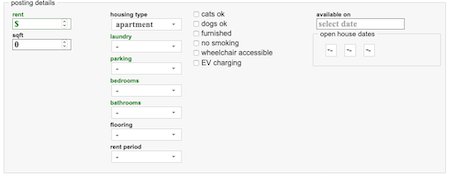
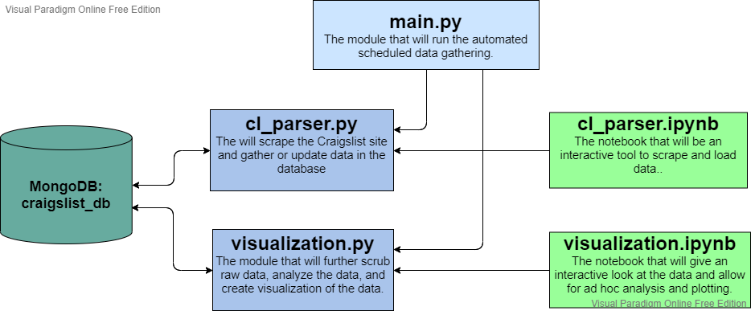
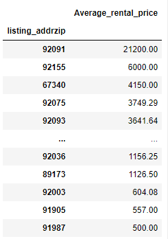
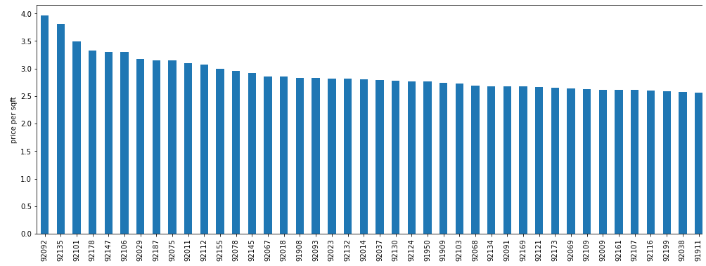
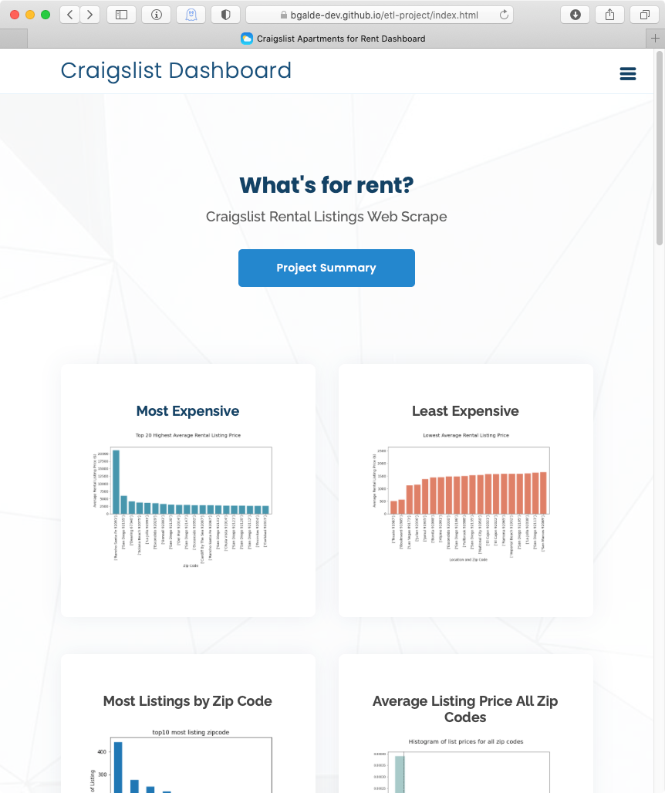

# ETL-Project
## UCSD Data Bootcamp ETL Group Project
### Team (scraping) Bottom of the Barrel
Ben Galde<br>
Melissa Monroe<br>
Tanlin Hung<br>
Kevin Mickey


## Intent
This group project will use [Craigslist](https://sandiego.craigslist.org/search/apa?housing_type=1) to scrape apartment listings for San Diego to determine:

The average rental price by location (TBD whether zip code or descriptors like "UTC" or "North Park")

At a minimum we will match up 1 bed/1 bath with other 1/1's and 2 bed/2 baths with other 2/2's to avoid invalid comparisions.  Other combinations may be included depending on time.

Data will be stored in a MongoDB.

Items we should be able to get from each posting:

- Date datetime
- Post ID
- URL
- Price integer (clean) Price pulled from CL
- Bedrooms
- Baths
- Sqft
- Location (straight from CL)


Things we will also try to determine from the listing:

- Average Listing Price by Zip
- Zip codes with highest availability (units/zip)
- Unit type availability (bedroom/bathroom combos)

We ended up sorting everything by zip codes. Late in the process we learned that there are 2 types of zip codes.  Area and point.  Most of us are familiar with area type codes that cover neighborhoods.  Point Zip codes are strictly PO Boxes, located at a Post Office.

--

#Process

We used MongoDB and Python.  We chose Mongo because we were unsure how structured CL postings were. However, it turns out SQL would have worked, because when you create a CL ad, many of the fields are constrained by pop-ups.  


`cl_parsery.py` is used to set up the database and holds all the functions used to scrape the site, clean up the data, and insert results into the database.

Below is a wire diagram of the different moving parts.



Listings were not added to the database if they did not include all of the following:

- Listing Title
- Listing Price
- Listing datetime
- Listing Creation datetime
- Data ID (the number at the end of the Listing URL)

When run this morning (2/24) it took 73 minutes and we went from 7608 to 8635 valid records.

If a listing had all of the above items, we then extracted the detail items:

- listing_latitude
- listing_longitude    
- listing_bedbath
- listing_sqft
- listing_availability
- listing_attributes
- listing_addrcountry
- listing_addrlocality
- listing_addrregion
- listing_addrzip
- listing_addrstreet
- listing_type
- listing_bed
- listing_bath
- listing_petsallowed
- listing_smokingallowed

We cleaned up the data before inserting it in Mongo - removing the $ and thousands separator from `listing_price` and "ft2" from `listing_sqft` so that those results could be used as numbers instead of strings. We also made assumptions regarding bed/bathrooms if no number was provided.  A blank bedroom = studio apartment, blank bathroom = 1/2 bath

## Running the ETL
There are several ways to run the ETL for Craigslist.

1.	For an interactive experience it can be run from a [Jupyter Notebook](./src/cl_rental_scrape.ipynb)
2. Run from a .bat or .sh file for automation on both windows and *nix 
environments [craigslist_etl.bat](./resources/scripts/craigslist_etl.bat) and [craigslist_etl.sh](./resources/scripts/craigslist_etl.sh)

## Data Sources
### Scraping Craigslist appartment and house rental pages
The pages for the San Diego apartment rentals are located here: [sandiego.craisglist.org/search/apa](https://sandiego.craigslist.org/search/apa)
### Zip code data
The primary zip code data is from [federalgovernmentzipcodes.us/](http://federalgovernmentzipcodes.us/). We renamed the file to [zipc_codes.csv](./resources/data/zipcodes.csv). 
The data was loaded into the database as the following object. This data is not used directly in the project as of yet and may be replaced in the future.

```json
[
	{
		"_id" : ObjectId("5995a09d60e205ec1b1000b8"),
		"Zipcode" : 76934,
		"ZipCodeType" : "STANDARD",
		"City" : "CARLSBAD",
		"State" : "TX",
		"LocationType" : "PRIMARY",
		"Lat" : 31.59,
		"Long" : -100.63,
		"Location" : "NA-US-TX-CARLSBAD",
		"Decommisioned" : "false",
		"TaxReturnsFiled" : 445,
		"EstimatedPopulation" : 818,
		"TotalWages" : 12675963
	}
]
```


##Analysis/Results


At the time of writing this report, the most popular types of apartments were (unsurprisingly) **1br/1ba** and **2br/2ba** with **3437** and **1951** units respectively. 

| Bed/Bath | Count|
| :--- | ---:|
| 1BR / 1Ba | 3437 |
| 2BR / 2Ba | 1951 |
| 2BR / 1Ba | 965 |
| 0BR / 1Ba | 589 |
| 3BR / 2Ba | 415 |
| 2BR / 1.5Ba | 117 |
| 2BR / 2.5Ba | 91 |

###Average Rental Price by Zip Code



**92091** is Rancho Santa Fe, and at that price and location is more than likely to be a house miscategorized as an apartment.

**92155** is Coronado.

**67340** is in rural southern Kansas, presumably a typo.

**91987** is in Tecate (Far East San Diego County near the border).

###20 Highest Zip Codes Average Listing Price


###20 Lowest Zip Codes Average Listing Price


###Top 10 Zip Code Listing count


In order from left to right:

- PO Box zip code in Escondido
- UTC
- 3x2 block area of downtown between A and C Streets, and Front and Third Aves, (SD city offices, Golden Hall etc, presumably a PO Box for city administered rental properties since there are no residential units in these blocks)
- PO Box zip code in Vista
- PO Box zip code in San Marcos
- San Marcos
- West Chula Vista
- PO Box zip code in Chula Vista
- East Carlsbad/Oceanside
- PO Box zip code in La Mesa

It turns out there are zip codes that are strictly PO boxes at the Post Office (points, not areas)

###Price per Sq Foot by Zip




## Leveraging our Results

In the future we expect to be able to integrate the results into a webpage that is automatically updated once a day.  Below is a screenshot of the placeholder. The live site can be found at [github.io] (https://github.com/melissamonroe/etl-project)

