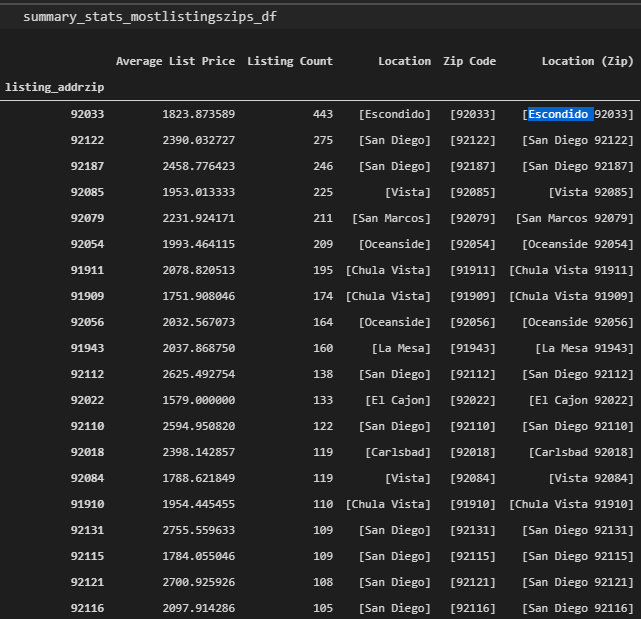
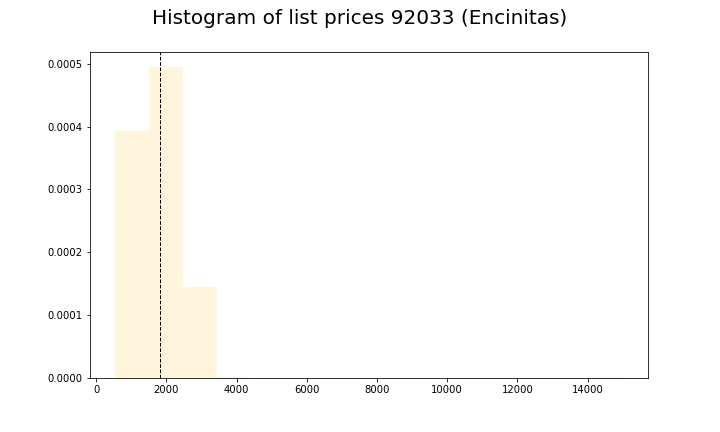

# Final Report 

## Project design and development
We wanted to create an ETL project that can be accessed both via an interactive tool as well as an automated tool to gather data at scheduled times. For this the design consisted of 5 core files and the database. 

The database we are using is MongoDB. This fit our data very well, as the data scraped from craigslist is somewhat unstructured and gave us flexibility in the end. In addition we are using Atlas which is a cloud base MongoDB. This way we are all working with the same data. The scraping can take a while to accomplish so it was a time saving measure for a single person to run the scrape. The scrape can be broken up to multiple processes with future functionality. 

We used a combination of regular python(.py) and Jupyter Notebook(.ipynb) files to create the design. There is also a config.py file that holds all the configuration information. A sample config file was added to the project to change for each individual.

The core classes to look at are the cl_parser.py and the visualization.py. These are the main files that connect to the database. In addition they are the modules that actually scrape the data and are the only files that access the database directly. 

The cl_scrape.py will scrape a given list of URLs. In this manner it can be used for any city and not just San Diego. Can also be used to only gather data from a particular area such as North San Diego.  There is some cleaning prior to being put in the database. Several items are defaulted to certain values if they don’t exist in the scrape. We did want as much raw data in the database for analysis and further cleaning if need be.

The visualization.py will provide direct access to Pandas Dataframes of the data. Both raw and cleaned data can be accessed. Furthermore the visualization can be produced and saved as png files for display via a dashboard or accessed via applications such as flask.

## Highest average listing price grouped by Location (Zip)

## Highest average listing price grouped by Location (Zip)

## Lowest average listing price grouped by Location (Zip)

## Lowest average listing price grouped by Location (Zip)

## Price distribution

Total number of list prices analyzed: 6596

Average listing price across all zip codes: $2171.0

Highest list price all zip codes $30000

Lowest list price all zip codes $475

### Listing price distribution across all zip codes

### Most listings by zip

Total number of list prices in 92033 (Encinitas): 443

Average listing price across 92033 (Encinitas): $1824.0

Highest list price in 92033 (Encinitas) $15000

Lowest list price in 92033 (Encinitas) $544

### Location with the most listings zip 92033 (Encinitas)

