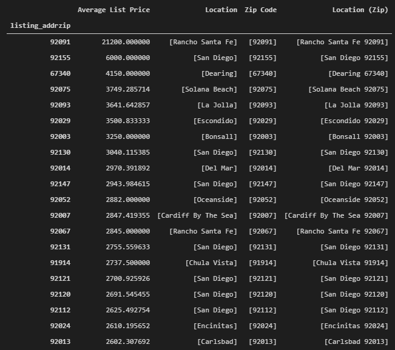
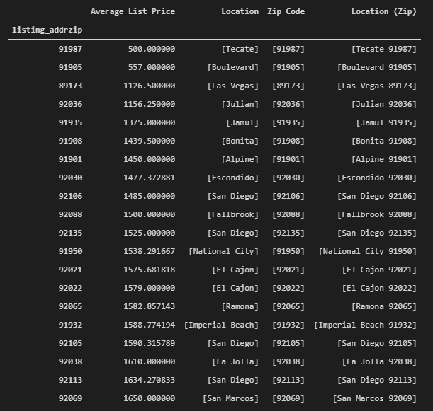

# Final Report

## Highest average listing price grouped by Location (Zip)

## Highest average listing price grouped by Location (Zip)

## Lowest average listing price grouped by Location (Zip)

## Lowest average listing price grouped by Location (Zip)

## Price distribution

Total number of list prices analyzed: 6596
Average listing price accross all zip codes: $2171.0

### Listing price distribution across all zip codes

